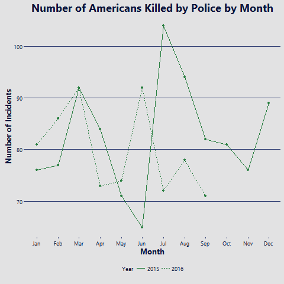
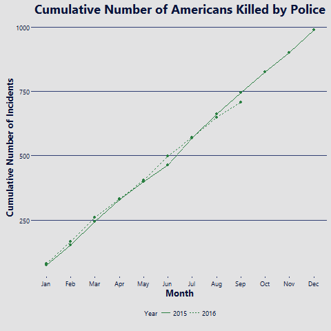
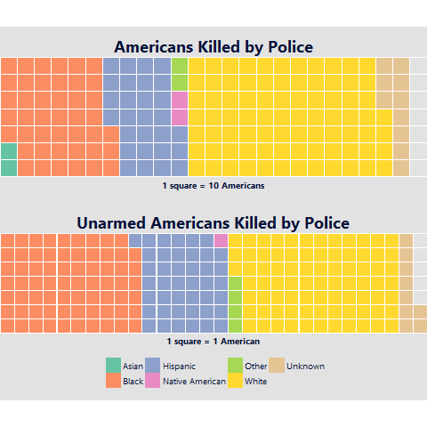
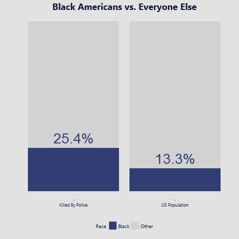

Black and Blue
===
*October 1, 2016*

What do the overall trends in the deadly police encounters in America look like? Are people
justified in feeling that their race is being targeted? Who is being shot by police? Dangerous
criminals or citizens in the wrong place at the wrong time? What can America do?

Here I explore [the data](https://raw.githubusercontent.com/washingtonpost/data-police-shootings/)
collected by The Washington Post since January 1, 2015. They've been curating a list of every
fatal shooting by a police officer in the United States. As stated in the repository's readme,
the data only contains incidents comitted by an activate duty police officer in the line of duty.
The Post says that they have more accurately tracked the incidents than the FBI and CDC.

I began by looking at frequency of the incidents by month. Are there certain times of the year
where incidents are more common?

Since I only have less than two years of data, we can't see any clear trends here. Over the months,
that I do have, we can see that the number of incidents fluctuates from month to month.

Looking at the cumulative number of incidents each year, we don't see any significant difference
between 2015 and 2016. Again, we only have two years of data so we can't conclude that much.

Next I wanted to look at the issue of race and how it might present itself in this data set. I
plotted a square pie chart or "waffle chart" using the [waffle](https://github.com/hrbrmstr/waffle)
package. The Washington Post does not define the labels used in the race column of their data set,
so the expanded labels I used are based on my best guess. I believe "N", labeled in the plot as
Native American, may also include Pacific Islanders.

On top, each square represents ten Americans who were kill by police. The color of the square
indicates the race of those ten Americans. Already we can see from this plot that white and Asian
Americans are under-represented while black and hispanic Americans are over-represented.

The bottom plot shows _unarmed_ Americans killed by police, where each squared represents one
American. Here we can see the over-representation of black and hispanic Americans is even more
pronounced. Even though white Americans compose sixty percent of the US population, they are
only fourty percent of this plot.  

This clearly show some racial bias police killings of unarmed Americans. While we cannot conclude
that this proves that some police are racist against black Americans, it further substaniates the
movement around the murders of unarmed black Americans. To drive this point home, I created one
more plot to highlight this bias. The left column shows the percentage of unarmed Americans killed
by police that are black: 33.5%. The right column shows the percentage of black Americans in the
US populations according to the US Census estimates for 2015: 13.3%. Here we can see the huge
different between these two numbers.

Putting all of the plots and graphs together, I created this infographic.

References
---

1. [The Washington Post Police Shooting Database](https://github.com/washingtonpost/data-police-shootings/)
2. [US Census Bureau, 2015 Estimates](https://www.census.gov/quickfacts/table/PST045215/00)
